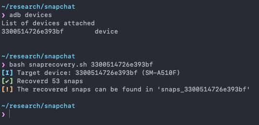

<h1 align="center">snaprecovery</h1>

Recover old Snaps that have “disappeared” from Snapchat
 
 

 
  <b>⚠️ This script only works for rooted Android devices! ⚠️</b>

 

## Dependencies
- [`adb`](https://developer.android.com/studio/command-line/adb)

This script was tested on an Android device running Android 10 with LinageOS with Snapchat v11.9.0.48 Beta

## How the recovery works
According to Snap Inc's [blog post](https://www.snap.com/en-US/news/post/how-snaps-are-stored-and-deleted) from 9 May 2013, Snaps are deleted once you have viewed them.

> **After a snap has been opened, the temporary copy of it is deleted from the device’s storage**. We try to make this happen immediately, sometimes it might take a minute or two. **The files are deleted by sending a “delete” instruction to the phone’s file system.** This is the normal way that things are usually deleted on computers and phones—we don’t do anything special (like “[wiping](https://en.wikipedia.org/wiki/Data_erasure)”).

In reality the Snaps get stored in `/data/user/0/com.snapchat.android/files/file_manager/chat_snap/` until you logout from the app. Once you logout, Snapchat deletes all of those files. 

Towards the very end of the blog post, they have mentioned that jailbreaking/rooting a device can allow us to access the **unopened Snap**. This is understandable as they need to store the file somewhere on the device so that it can be viewed by the user.

> **While an unopened snap is being stored on the device, it’s not impossible to circumvent the Snapchat app and access the files directly**. This isn’t something we support or encourage and in most cases **it would involve jailbreaking or “rooting” the phone** and voiding its warranty. If you’re trying to save a snap, it would be easier (and safer) to just take a screenshot or take a picture with another camera.

It is also mentioned that **deleted** Snaps can be recovered using the right forensics tools.

> Also, if you’ve ever tried to recover **lost data after accidentally deleting a drive** or maybe watched an episode of CSI, you might know that **with the right forensic tools, it’s sometimes possible to retrieve data after it has been deleted**

We don't need any forensics tools. We can simply use `adb pull` to fetch the files because they are never deleted. But once you logout from the app and after Snapchat deletes the Snaps, you will need the right forensics tools to recover the files.

Since they are stored on the device, we can easily "recover" them by simply copying them from the Android device to our computer. The only issue with doing this is that the files do not have the proper file extension which prevents us from opening the file in the correct program. `snaprecovery` automates this whole proccess by fetching the files and then appending the correct file extension depending on the file's mime type.
